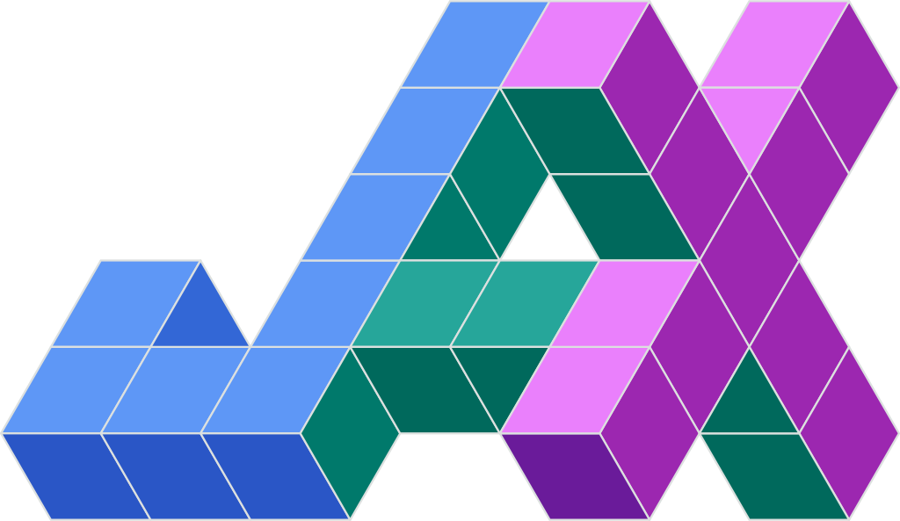
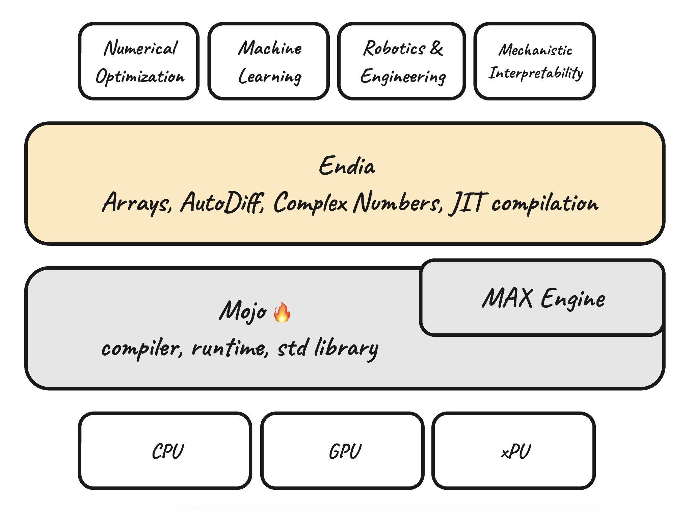

<div align="center" style="max-width: 700px; margin: auto;">
  
</div>

###

**Endia** is a lightweight, dynamic Neural Network library for Mojo, featuring:

- **Automatic differentiation**: Compute derivatives of arbitrary order.
- **Complex numbers:** Use Endia for advanced scientific applications.
- **Dual API:** Choose between a PyTorch-like imperative or a JAX-like functional interface.
- **JIT Compilation:** Leverage [MAX](https://www.modular.com/) to speed up training and inference.

<div align="center">
  
  [Website] | [Docs] | [Getting Started]

  [Website]: https://endia.vercel.app/
  [Docs]: https://endia.vercel.app/docs/array
  [Getting Started]: https://endia.vercel.app/docs/get_started

</div>

> <span style="color: yellow;">⚠️ ***Warning:**</span> Endia is currently in an early development stage and not yet ready for production use. The API is subject to change without notice. Stay tuned for more exciting features to come (e.g. GPU support).*


## Installation

1. **Set up your project using the [Mojo nightly build](https://docs.modular.com/mojo/manual/get-started) 🔥 via [Magic](https://docs.modular.com/magic/) 🪄**.

2. **Install the Endia Package** (at the top level of your project):

    ```bash
    curl -sS https://raw.githubusercontent.com/endia-org/Endia/nightly/install.sh | bash
    ```

    > *<span style="color: green;">**Note:**</span> In the near future, you will be able to simply call `magic add endia`, which will manage this dependency in your project's environment automatically. QOL is in sight!*

####

## A tiny example

In this guide, we'll demonstrate how to compute the **value**, **gradient**, and the **Hessian** (i.e. the second-order derivative) of a simple function. First by using Endia's Pytorch-like API and then by using a more Jax-like functional API. In both examples, we initially define a function **foo** that takes an array and returns the sum of the squares of its elements.

### The **Pytorch** way

<!-- markdownlint-disable MD033 -->
<p align="center">
  <a href="https://pytorch.org/docs/stable/index.html">
    
  </a>
</p>

When using Endia's imperative (PyTorch-like) interface, we compute the gradient of a function by calling the **backward** method on the function's output. This imperative style requires explicit management of the computational graph, including setting `requires_grad=True` for the input arrays (i.e. leaf nodes) and using `create_graph=True` in the backward method when computing higher-order derivatives.

```python
from endia import Tensor, sum, arange
import endia.autograd.functional as F


# Define the function
def foo(x: Tensor) -> Tensor:
    return sum(x ** 2)

def main():
    # Initialize variable - requires_grad=True needed!
    x = arange(1.0, 4.0, requires_grad=True) # [1.0, 2.0, 3.0]

    # Compute result, first and second order derivatives
    y = foo(x)
    y.backward(create_graph=True)            
    dy_dx = x.grad()
    d2y_dx2 = F.grad(outs=sum(dy_dx), inputs=x)[0]

    # Print results
    print(y)        # 14.0
    print(dy_dx)    # [2.0, 4.0, 6.0]
    print(d2y_dx2)  # [2.0, 2.0, 2.0]
```

### The **JAX** way

<!-- markdownlint-disable MD033 -->
<p align="center">
  <a href="https://jax.readthedocs.io/en/latest/quickstart.html">
    
  </a>
</p>

When using Endia's functional (JAX-like) interface, the computational graph is handled implicitly. By calling the `grad` or `jacobian` function on foo, we create a `Callable` which computes the full Jacobian matrix. This `Callable` can be passed to the `grad` or `jacobian` function again to compute higher-order derivatives.

```python
from endia import grad, jacobian
from endia.numpy import sum, arange, ndarray


def foo(x: ndarray) -> ndarray:
    return sum(x**2)


def main():
    # create Callables for the first and second order derivatives
    foo_jac = grad(foo)
    foo_hes = jacobian(foo_jac)

    x = arange(1.0, 4.0)       # [1.0, 2.0, 3.0]

    print(foo(x))              # 14.0
    print(foo_jac(x)[ndarray]) # [2.0, 4.0, 6.0]
    print(foo_hes(x)[ndarray]) # [[2.0, 0.0, 0.0], [0.0, 2.0, 0.0], [0.0, 0.0, 2.0]]
```

*And there is so much more! Endia can handle complex valued functions, can perform both forward and reverse-mode automatic differentiation, it even has a builtin JIT compiler to make things go brrr. Explore the full **list of features** in the [documentation](https://endia.org).*


## Endia's truly minimalistic Stack

<div align="center" style="max-width: 700px; margin: auto;">
  
</div>

## Why another ML framework?

- 🧠 **Advance AI & Scientific Computing:** Push boundaries with clear and understandable algorithms
- 🚀 **Mojo-Powered Clarity:** High-performance open-source code that remains readable and pythonic through and through
- 📐 **Explainability:** Prioritize clarity and educational value over exhaustive features

*"Nothing in life is to be feared, it is only to be understood. Now is the time to understand more, so that we may fear less."* - Marie Curie

## Contributing

Contributions to Endia are welcome! If you'd like to contribute, please follow the contribution guidelines in the [CONTRIBUTING.md](https://github.com/endia-org/Endia/blob/main/CONTRIBUTING.md) file in the repository.

## Citation

If you use Endia in your research or project, please cite it as follows:

```bibtex
@software{Fehrenbach_Endia_2024,
  author = {Fehrenbach, Tillmann},
  license = {Apache-2.0 with LLVM Exceptions},
  doi = {10.5281/zenodo.12810766},
  month = jul,
  title = {{Endia}},
  url = {https://github.com/endia-org/Endia},
  version = {24.9.0},
  year = {2024}
}
```

## License

Endia is licensed under the [Apache-2.0 license with LLVM Exeptions](https://github.com/endia-org/Endia/blob/main/LICENSE).