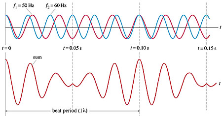
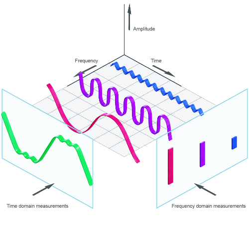

# Fast Fourier Transform

The fft module in Endia is a collection of algorithms and utilities for performing Fast Fourier Transforms (FFT) and its inverse. The module is designed to be very similar to the `torch.fft` modules, with the benefit of being written in pure Mojo from scratch in only a few lines of code. This does not mean that the module is slow. In fact it performs on par with the PyTorch FFT implementation, and in some cases, it is even faster.

   <!-- style="max-width: 800px;" -->

### But what is a Fast Fourier Transform?

Let's say you are a Music Producer and you want to build your own Synthesizer. How would you go about it? 

Every sound you hear is a mix of different waves layed above each other, in other words we have sound waves that interfere. Depeding on the frequency of these different soudnwave and their respective amplitudes, our brain creates a distinct sense for every possible combination of these.

   <!-- style="max-width: 800px;" -->

Let's take a step back and instead of creating a soudn from scrathc we woudl liek to take a real world soudn and pass it to a  compute and then possilbe manipulate it a bit. Say we have a Saxophone and play a single note. Let's iuse amicrohphone to record this beautiful soudn. In digital computign all frequency signals are discrete, that means that after we measured some real world sound with a microphone and have passed it to our computer, in contrast to the real smooth curve above, we actually now only have discrete data points of the wave at every time step of the sample. 

In order to reason about this frequency we for example simply plot those data points and stare at the image, which would nicely visualize the sound bwáve as it poasses through the air. However, we cant really do more with such an image, we cannot manipalte it and cannot reaon about it. We woudl rather liek to reason about it in terms of the frequncies that make upt the disticnt sound wave. If we knew about hese indiviudla frequencies, ie. the soudn spectrum we could  now properly manipualte those frequencies, take ceratin frequncies out for example to manipualte and change the sound. Given our smooth Saxphone sound, we might for example change it sfrequncy spectrum to make it soudn like a violin. Ok, but how can we do this, really?

That where the Fast Fourrier Transform comes into play. Teh FFT takes a signal from the time domain (as is our soudn wave of the Saxophone recording) and converts it to a Signal in the Ferquency domain (where we can manipulate the frequencies individulally). W also have a inverse Fast Fourier Tranform (IFFT) which does exactly the opposlite, i.e convert s signal fro teh Frequency doamin to one of the Time domain. 

   <!-- style="max-width: 800px;" -->

