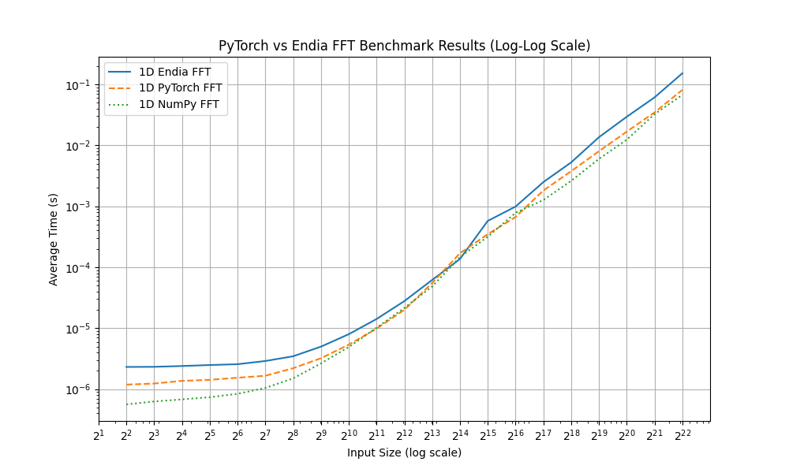

# Fast Fourier Transform 

From forgotten handwritings by Gauss in the early 1800s, through a rediscovery in the 1960s (for detecting atomic tests 💣), to its ubiquitous presence in modern technology, the **Fast Fourier Transform (FFT)** is one of the most impactful and elegant algorithms ever. Endia's new FFT module offers a suite of optimized FFT implementations - integrated into Endia's AutoGrad engine, mirroring the functionality of popular frameworks like PyTorch, while benefiting from being written in pure Mojo.

#### 

   <!-- style="max-width: 800px;" -->

## Overview

This module provides a suite of optimized, non-recursive Fast Fourier Transform (FFT) implementations based on the Cooley-Tukey algorithm, featuring parallel processing and efficient multi-dimensional operations. 🏛️

- [utils.mojo](https://github.com/endia-org/Endia/blob/nightly/endia/functional/fft_ops/utils.mojo)
  - Functions for data buffer manipulation
  - Bit reversal operations
  - Encoding/decoding of runtime parameters
  - Trait for differentiable FFT operations

- [fft_cooley_tukey.mojo](https://github.com/endia-org/Endia/blob/nightly/endia/functional/fft_ops/fft_cooley_tukey.mojo)
  - Three iterative versions of Cooley-Tukey FFT algorithm
    1. Mimics divide-and-conquer logic without recursion
    2. Parallelizable version creating independent subtasks
    3. Hybrid approach:
       - Creates independent tasks through iterative divide-and-conquer
       - Applies parallel bit-reversal Cooley-Tukey algorithm on subtasks
  - Enables efficient parallelization and improved performance

- [fftn.mojo](https://github.com/endia-org/Endia/blob/nightly/endia/functional/fft_ops/fftn_op.mojo) and [ifftn.mojo](https://github.com/endia-org/Endia/blob/nightly/endia/functional/fft_ops/ifftn_op.mojo)
  - Multi-dimensional FFT and Inverse FFT operations
  - Use parallelizable fft_cooley_tukey algorithm
  - IFFT conjugates input/output and scales output
  - Efficient multi-dimensional processing:
    - Avoids slicing operations
    - Uses axis swapping and reshaping
    - Requires k calls of parallel FFT function for k dimensions of n-dimensional array

- Other FFT operations
  - [fft](https://github.com/endia-org/Endia/blob/nightly/endia/functional/fft_ops/fft_op.mojo), [ifft](https://github.com/endia-org/Endia/blob/nightly/endia/functional/fft_ops/ifft_op.mojo), [fft2](https://github.com/endia-org/Endia/blob/nightly/endia/functional/fft_ops/fft2_op.mojo), [ifft2](https://github.com/endia-org/Endia/blob/nightly/endia/functional/fft_ops/ifft2_op.mojo)
  - Specialized cases of fftn and ifftn operations

## Benchmarks 🔥

The plot below illustrates speed comparisons of 1-dimensional FFTs across various input sizes, ranging from `2**1` to `2**22`.

   

#### 

Endia's FFT implementation, despite its compactness, delivers performance **not far behind established frameworks**. Further optimizations and algorithmic refinements could push Endia's performance to fully match or even exceed existing solutions.

**If you have ideas on how to further enhance Endia's FFT performance or functionality, your contributions are welcome! Feel free to submit a pull request to our nightly branch or explore our developer documentation. Let's push the boundaries of science together! 🚀**

## Current Limitations and Work in Progress 👷‍♀️

- Axis dimensions to transform must currently be a power of 2. This restriction will soon be lifted.
- No GPU support yet: Once the MAX Engien supports GPU, this will be top priority.
- Edge-case testing for differentiable FFT ops -> WIP!
